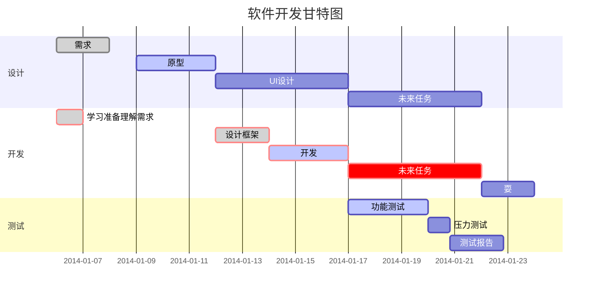

# Test Demo

# 使用说明
基于fragmentation实现的穿山甲开屏广告demo

download[^RUNOOB]

[^RUNOOB]: http://www.baibu.com
> 最外层
> > 第一层嵌套
> > > 第二层嵌套

```javascript
$(document).ready(function () {
alert('RUNOOB');
});
```

```java
 @Override
    public void onSaveInstanceState(Bundle outState) {
        super.onSaveInstanceState(outState);
        mDelegate.onSaveInstanceState(outState);
    }
```
看不懂请自行 [百度](https://baidu.com)


| 版本号 | 更新时间 | 更新内容 |
| :-----| ----: | :----: |
| 1.0 | 2020/06/12 | 添加授权用户检测 |
| 1.1 | 2021/02/02 | 修复bug上传数据 |
| 1.2 | 2021/07/02 | 引入fragmentation和穿山甲广告 |


 